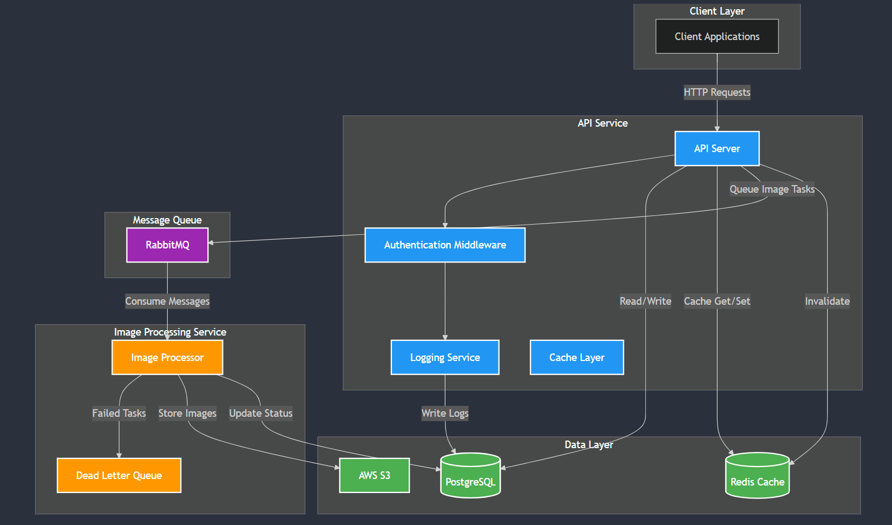

# Product Management System

A **scalable backend system** built with **Go** for managing products, featuring **asynchronous image processing**, **Redis caching**, **RabbitMQ messaging**, and **AWS S3 storage**. 

## 🌟 Features at a Glance
- 🔐 **User Authentication & Authorization** with JWT  
- 📦 **Product Management (CRUD)**  
- 🖼️ **Asynchronous Image Processing** with RabbitMQ  
- 🎛️ **Caching** using Redis  
- ☁️ **Image Compression & S3 Storage**  
- 🛠️ **Clean Architecture** & **Dependency Injection**  
- 🪶 Lightweight, scalable, and production-ready!  

---

## 📐 System Architecture

### Key Components:
1. **API Service**  
   - Built with **Go** and **Gin Framework**
   - Handles user authentication, CRUD operations, and product management  
2. **Image Processor**  
   - Consumes RabbitMQ queues for **asynchronous image processing**  
   - Compresses and uploads images to AWS S3  

### Stack:
- **Database**: PostgreSQL + GORM ORM  
- **Queue**: RabbitMQ  
- **Cache**: Redis  
- **Storage**: AWS S3  
- **Migrations**: Goose  
- **Logging**: Zap  

---

## 🎥 Demonstration Video

Demonstration: [https://drive.google.com/file/d/1HgvUf9p9DRH8J3Sha-spk_v3YhDxJd2X/view?usp=sharing](https://drive.google.com/file/d/1HgvUf9p9DRH8J3Sha-spk_v3YhDxJd2X/view?usp=sharing)

Click the preview above to watch the full video.

---
## 🚀 Quick Start  

### Clone and Setup
```bash
# Clone the repository
git clone https://github.com/KPVISHNUSAI/product-management-system.git
cd product-management-system

# Configure environment variables
cp .env.example .env
```

### Start the System
```bash
# Start services with Docker
make docker-up

# Run database migrations
make goose-up

# Start API server (Terminal 1)
make run

# Start Image Processor (Terminal 2)
go run image-processor/main.go
```

---


## ⚙️ Project Structure
```plaintext
product-management-system/
├── api/                            # API Service
│   ├── config/                     
│   │   └── config.go              # Application configuration
│   ├── handlers/                   
│   │   ├── auth.go                # Authentication handlers
│   │   └── product.go             # Product handlers
│   ├── middleware/                 
│   │   ├── auth.go                # JWT authentication
│   │   └── logging.go             # Request logging
│   ├── models/                     
│   │   ├── user.go                # User model
│   │   └── product.go             # Product model
│   ├── repository/                 
│   │   └── postgres/
│   │       ├── user.go            # User database operations
│   │       └── product.go         # Product database operations
│   ├── services/                   
│   │   ├── user.go                # User business logic
│   │   └── product.go             # Product business logic
│   ├── tests/       
│   │   └── unit/
│   │          └── handlers/
│   │                   └──product_test.go    
│   │          └── services/
│   │                   ├── product_test.go    
│   │                   └──user_test.go    
│   │   └── integration/
│   │                   └──api_test.go   
│   │   └── benchmark/
│   │                   └──product_test.go   

│   └── main.go                    # API entry point
│
├── image-processor/               # Image Processing Service
│   ├── config/
│   │   └── config.go              # Image processor config
│   ├── processor/
│   │   └── image.go               # Image processing logic
│   ├── queue/
│   │   └── consumer.go            # RabbitMQ consumer
│   └── main.go                    # Image processor entry point
│
├── pkg/                          # Shared packages
│   ├── cache/
│   │   └── redis.go               # Redis client implementation
│   ├── database/
│   │   └── postgres.go            # Database connection
│   ├── logger/
│   │   └── zap.go                 # Logging configuration
│   ├── messaging/
│   │   └── rabbitmq.go            # RabbitMQ client
│   └── storage/
│       └── s3.go                  # AWS S3 operations
│
├── migrations/                   # Database migrations
│   └── sql/
│       ├── 20241208000001_create_users.sql       # Users table
│       └── 20241208000002_create_products.sql    # Products table
│
├── docs/                        # Documentation
│   ├── architecture-diagram.png  # System architecture
│   ├── api.md                   # API documentation
│   └── setup.md                 # Setup instructions
│
├── docker/                      # Docker configurations
│   ├── api/
│   │   └── Dockerfile           # API service Dockerfile
│   └── image-processor/
│       └── Dockerfile           # Image processor Dockerfile
│
├── docker-compose.yml           # Container orchestration
├── Makefile                     # Build automation
├── .env.example                 # Environment variables template
├── .gitignore                   # Git ignore rules
├── go.mod                       # Go modules
├── go.sum                       # Go dependencies
└── README.md                    # Project documentation
```

---

## 📄 API Documentation  

### 🛡️ Authentication
#### **Register**  
```http
POST /api/auth/register
{
    "email": "user@example.com",
    "name": "User Name",
    "password": "password123"
}
```

#### **Login**  
```http
POST /api/auth/login
{
    "email": "user@example.com",
    "password": "password123"
}
```

### 📦 Products
#### **Create Product**
```http
POST /api/products
Authorization: Bearer <token>
{
    "product_name": "Product Name",
    "product_description": "Description",
    "product_price": 99.99,
    "product_images": ["http://example.com/image.jpg"]
}
```

#### **Get Product**
```http
GET /api/products/:id
Authorization: Bearer <token>
```

#### **List User Products**
```http
GET /api/products/filter/?user_id=1&min_price=10.0&max_price=100.0&product_name=test
Authorization: Bearer <token>
```

---

## 🛠️ Development & Deployment  

### Docker Commands
```bash
# Start services
make docker-up

# Stop services
make docker-down

# View logs
docker-compose logs -f
```

### Database Migrations
```bash
# Run migrations
make goose-up

# Rollback migrations
make goose-down
```

### Testing
```bash
# Run all tests
make test

# Run specific tests
go test ./api/...
```

---

## 🧑‍💻 Technical Features  
- **Clean Architecture**  
- **Interface-based Design**  
- **Structured Logging** with Zap  
- **Error Handling & Recovery**  
- **Middleware Support**  
- Comprehensive **Test Coverage**  
- **Dockerized Deployment**

---

## 🚦 Monitoring & Health Checks  
- `/health` - API service health  
- `/health/db` - Database connection  
- `/health/cache` - Redis connection  
- `/health/queue` - RabbitMQ connection  

---

## 🌐 Contributing
1. Fork the repository  
2. Create a feature branch  
3. Implement changes  
4. Write/update tests  
5. Submit a pull request  

---

## 📜 License  
This project is licensed under the **MIT License**. See `LICENSE` for details.

---

## 💬 Support  
For any queries:  
- Create a GitHub issue  
- Submit a pull request  
- Contact: kk4563@srmist.edu.in 
- RegNo: RA2111003011135

🎉 **Happy coding!**
